# Vehicle Detection

## Introduction

A simple toolkit in Python for vehicle detection on images/frames using traditional computer vision tricks. There are functions responsible for extracting features from image data as well as classifier based on these features.

#####  Requirements

* [Python 3.x](https://www.python.org/downloads/release/python-361/)
* [OpenCV](http://docs.opencv.org/3.0-beta/)
* [MoviePy](https://zulko.github.io/moviepy/ref/VideoClip/VideoClip.html)
* [scikit-image](http://scikit-image.org/)
* [Jupyter (optional)](http://jupyter.org/)

NOTE: Tested on Ubuntu
##### Map
* _Code Scripts_  
  [classifier.py]('./classifier.py') : responsible for features generation from image files    
  [find.py]('./find.py') : the pipeline for vehicle detection

* _Data_  
You can use any 64x64 images for cars and non-cars to train the classifier. Just modified the paths for cars and non-cars in [find.py]('./find.py'). The data I use can be found [here](https://github.com/udacity/CarND-Vehicle-Detection), provided by [Udacity](https://udacity.com).

* _Demo_  
A simple demo is presented as a Jupyter notebook, [lab.ipynb](./lab.ipynb), but this is only for making image for markdown writing.

* _Result_  
I run the detection pipeline **WITHOUT**[1] cached frame on sample images in [./test_images]('./test_images') detection on those images is stored in [./output_images]('./output_images')
[1]: The pipeline is currently designed mainly for detections on videos, therefore some inelegant changes should be made in the code to disabled caching.

*  [project_video_output.mp4]('./project_video_output.mp4') is a sample result on video.

##### Run
Call format:
```
$ python find.py --filename <video file> [style] [--retrain <number_per_class>]
```
An example call:
```
$ python find.py --filename ./test_video.mp4 lazy --retrain 8000
```


## Techniques

### Features
##### 1. Histogram of Oriented Gradient (HOG)  

###### Quick Explantion
Basically, inside a cells of pixel, HOG is a features set of an image that counts the gradients in different range of angles. This features in a cell can be present as a histogram in polar coordinate system. An image can have multiple cells of HOG features, which make up the HOG feature for the whole image.

###### Implementation
OpenCV provides easy function to calculate the HOG feature for a given image(single channel). Here is the [original function](http://scikit-image.org/docs/dev/api/skimage.feature.html#skimage.feature.hog). I use only square cells and square blocks, so I wrap the function into a single function called [`hog_feat`](./classifier.py#L62-L75)
```python
def hog_feat(img, feat_vec=False):
    gray = CVT['GRAY']
    im = cv2.cvtColor(img, gray)
    return hog(im, orientations=ort,
                pixels_per_cell=(ppc, ppc),
                cells_per_block=(cpb, cpb),
                 transform_sqrt=False, feature_vector=feat_vec)
```
* _Selecting Channel_  
The HOG calculation can be applied on any channels in any color spaces. After some trials, I decided to use grayscale to calculate the HOG features. I pick grayscale in my pipeline, which maintain the rough outline of the image as shown in the middle.  The Y channel is also good but for convenience in coding I disabled channel tuning for the HOG feature.  Other channels may contains stronger information about what can't be a car, for example a sign is stand out in the Cr channel shown to the rightmost image.
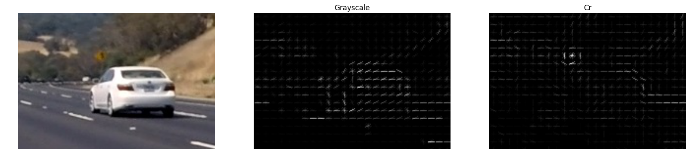

* _Pixels Per Cell, Cells Per Block and Orientation_  
I use global parameters `ppc` and `cpb` to store this two values to ensure consistency between training and detection.

        ppc = 16 # pixels per cell
        cpb = 2  # cells per block
        ort = 6  # orientations

    Basically `ppc` controls the window's size in which HOG is calculated. `cpb` controls how many cells in a block you want to normalize your HOG. And orientation indicate the number intervals for your HOG. Here is the different between `ppc = 8` and `ppc = 16`. I pick `ppc = 16` in this project.
    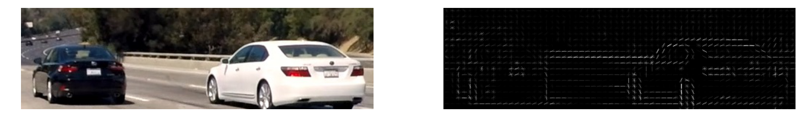  
    

    And blow are HOG with `ort = 12` and `ort = 6`:
    
    

* _HOG on the Training Data_  
    It seems 16 is not a good choice, but those samples are hard even for smaller cells and we still have other information to involve in the feature set.
    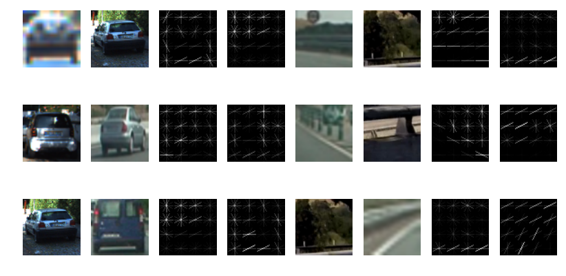

* _HOG features for SVM_  
    To fit in the SVM classifier, the hog features will be raveled to a 1-D array for each sample image. This is implemented by setting `feat_vec = True` or using the `ravel` function in NumPy.


##### 2. Color Related Features
###### Quick Explantion
Image can be interpreted in different ways, for example, we can make scatter plot in a 3d space form by axis of channel values.   
Here is scatter plots for a car and non-car sample in HLS color space:  


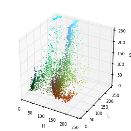
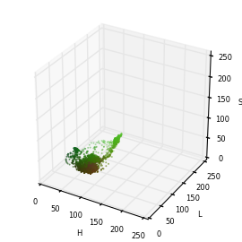


###### Color Histogram
We can take the projections of the scatter plot and form channel-based histograms. Below are car and non-car image in color histograms.
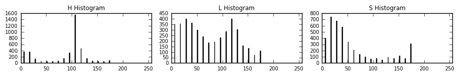  
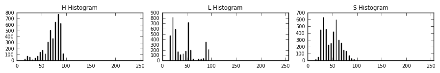  
The Implementation is pretty staightforward, we take an image, convert it into targeted color space which is stored in a global variables `cspace`, and calculated the histograms for each channel, the bin values than combined and make the histogram features, check the [`color_hist_feat`](./classifier.py#L87-L94)

```python
def color_hist_feat(img):
    ch_hist = [np.histogram(img[:,:,i], bins = hist_bins)[0]
               for i in range(img.shape[2])]
    return np.hstack(ch_hist)
```


###### Color Spatial Bins

A image can be interpreted as a two-dimensional field, color bins is a raveled version of the image. First takes the means of all the columns of the image and and then do the same for all the rows. These gives us 2 signal figures for one channel and 6 for 3 channels. Supposed we scaled the image to `8 x 8`, and we will get `8 x 8 x 3 = 192` columns/rows:
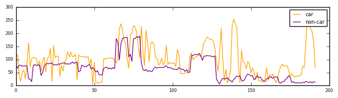

The implementation [`color_bin_feat`](./classifier.py#L77-L85) is also simple: 
```python
def color_bin_feat(img):
    colors = [cv2.resize(img[:,:,i], spatial_size).ravel()
              for i in range(img.shape[2])]
    return np.hstack(colors)
```


##### 3. Integrated Features
The Features mentioned above is combined and scaled to unit variance using sklearn's [`StandardScaler`](http://scikit-learn.org/stable/modules/generated/sklearn.preprocessing.StandardScaler.html). The final features is a 456 dimensional array.
Here is the final parameters set:
```python
ppc = 16
cpb = 2  
ort = 6  
cspace = 'YCrCb'    
spatial_size = (8, 8)
hist_bins = 16
```
I defined a class called [`feature maker`](./classifier.py#L98-L135) and saved the scaler object, to make sure the feature making process is consistent in both training and detecting.


### Training
You might want to check the definition of  [`from_paths`](./classifier.py#L142-L212) function in [./classifier.py](./classifier.py) to know about how to draw data from file system, but nothing fancy.

I used a SVC leaving all the parameters as default except setting a random_state. Here is  a training output:
```
reading samples list...

reading sample file list takes 0.117s

getting hog features...
100%|████████████████████████████████████| 16000/16000 [00:33<00:00, 483.27it/s]
getting features takes 33.282s
(16000, 456) (16000,)
-1.41217054696 5.00468404968 -0.0491256958198

training the SVC...
training takes 14.20s
prediction takes 3.38s
0.9953125

```
The trained classifier, scaler and feature maker will be pickled and stored in [./clf.pickle](./clf.pickle), which is loaded in [./find.py](.find.py)


### Searching
##### 1. Windows on HOG Blocks
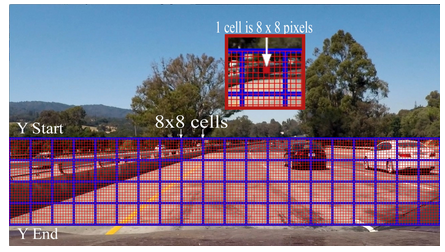  
[Image from Udacity Self Driving Car Nanodegree](https://udacity.com)  

The first searching strategy is to first calculate HOG over the whole scaled region of interest and do exhaustedly searching. The HOG features are extracted from the calculated HOG blocks and ravel to fit in the classifier.

The code is the [`_block_search`](./find.py#L150-L209) function in [./find.py](./find.py). This strategy needs position tokens to define the region of interest and the scale for scaling the area to fit 64x64 searching. An example: `(360, 600, 1.5)` means the region is from 360 to 600 vertically and the targeted window is 96x96 in size.

NOTE: I haven't optimize `pos` for this strategy yet because this method is the slowest for now.

##### 2. Pre-designed Windows
This is pretty easy to understand. In a certain perspective condition, vihecles show up near the vanishing point is smaller and close to each other and vice versa.

Here I write a [`box_generator`](./find.py#L28-L64) functions in [./find.py](./find.py). A example call:
```
box_generator((390, 600), (0, 1280), yd_ratio = 0.1,
               scales = [1.2,2.0,2.5,3.0,3.6], xover = 0.6)

```
this will gives boxes like:  


##### 3. Lazy Windows
Since we are detecting on continuous frames, a lazy method is to search the neighboring area of bounding boxes detected from the last frame.

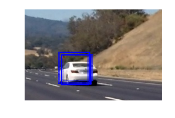  
However, we should still do a normal window search when there's no bounding boxes to track from the last frame. Besides tracking the previous detection, we should do a lazy version of window search to make sure there's no new 'come in' vehicles from the vanishing point(when the driver accelerate), or from the other lanes.
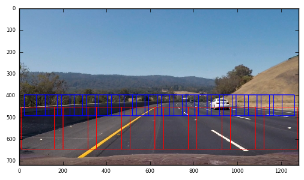


##### 4. Multiple Detection, Caching and Heatmap
Since the classifier is not perfect, it might take some other objects as vehicles, which is called false positive. But fortunately, false positive is not likely to show up continuously in the video, and the classifier will often gives multiple bounding boxes for a single vehicle. With previous boxes cached and multiple detection, we can apply the heatmap trick to get rid of false positive.


To apply heatmap we count the layers of bounding boxes for an overlapped area. When the count is higher than the threshold, we believe there's a vehicle.  

Here's how I implement heatmap on multiple boxes:
```python
def _heat_box(self, shape, bboxes, thres = heat_thres):
    heat = np.zeros(shape)
    for bbox in bboxes:
        heat[bbox[0][1]:bbox[1][1], bbox[0][0]:bbox[1][0]] += 1
    heatmap = (heat > thres).astype(int)

    result = []
    labels = label(heatmap)
    for car_num in range(1, labels[1] + 1):
        nonzero = (labels[0] == car_num).nonzero()
        # Identify x and y values of those pixels
        nonzeroy = np.array(nonzero[0])
        nonzerox = np.array(nonzero[1])
        bbox = ((np.min(nonzerox), np.min(nonzeroy)), (np.max(nonzerox), np.max(nonzeroy)))
        result.append(bbox)
    return result
```


### Discussion
##### Efficiency
This pipeline is not perfect. The most annoying is it is very slow. It takes me hours to manually design windows and rois, which makes it 100% fragile when it comes to detecting on videos from different source.

##### Jumpiness of Boxes
The boxes is quite jumpy, this is because the designed bounding boxes is not perfect and heatmap is actually doing an and operation, which is too strong and would waste some boxes.

##### Improvement
Convolutional Neural Network would save us. One of the most popular trick might be using [YOLO](https://pjreddie.com/darknet/yolo/)
